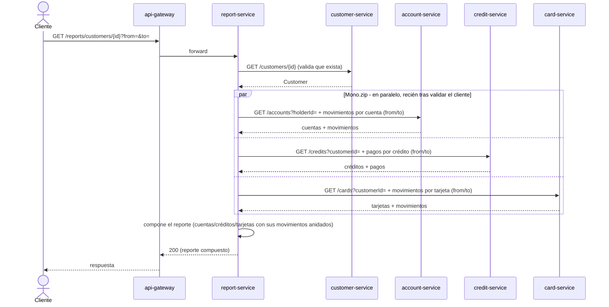
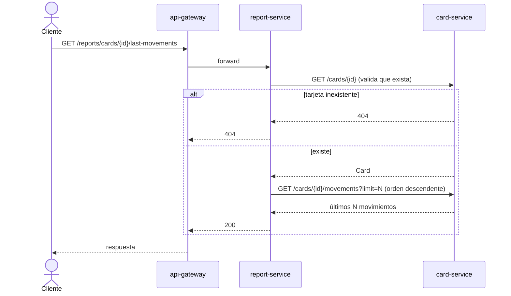

# Diagramas de secuencia — report-service

Requerimiento no funcional (Parte I): *"Elaborar diagramas de secuencia de cada microservicio."*

## Reporte general por cliente (composición de APIs, D4)

`report-service` no tiene base de datos propia: compone en el momento contra los 4 servicios de
dominio. El cliente se valida primero (con `Mono.defer` en las tres llamadas siguientes, para no
dispararlas antes de confirmar que existe).

## Últimos movimientos de una tarjeta (crédito o débito)

